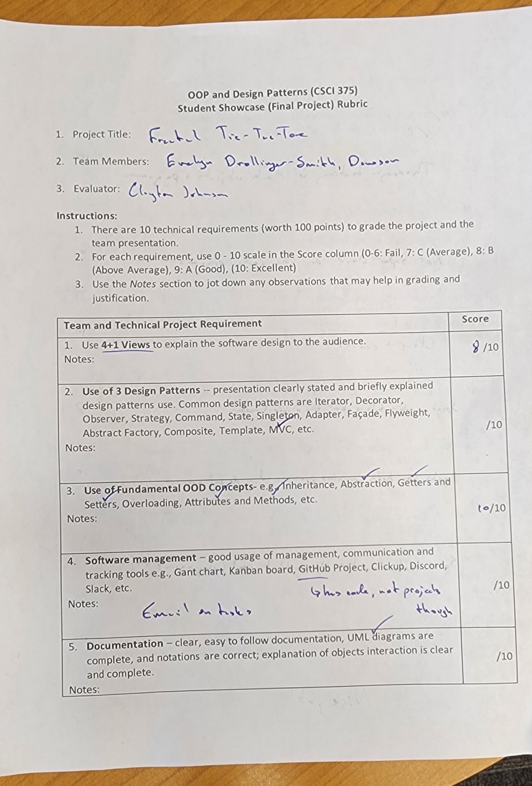
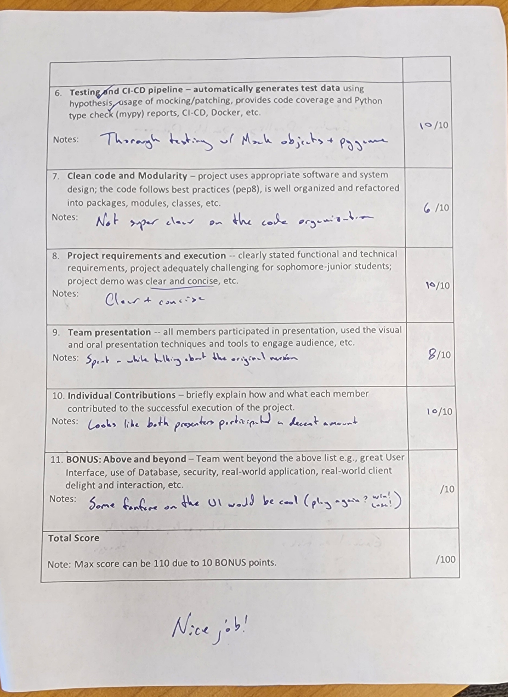
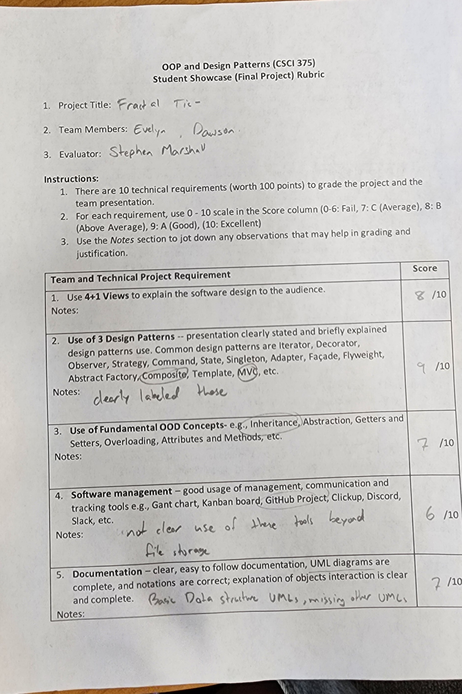
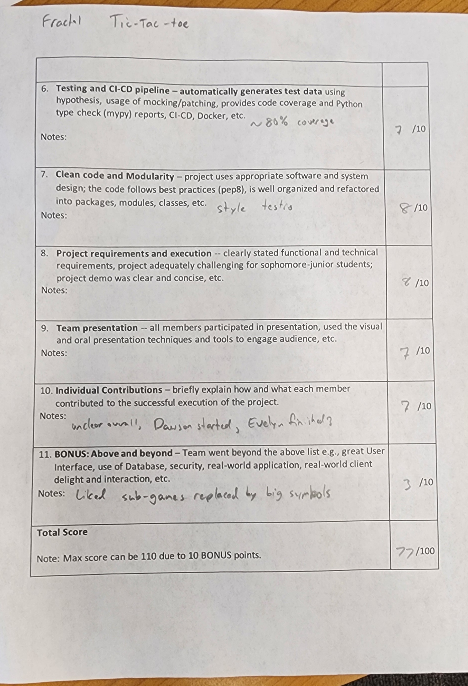

# OOP-Final

| Name | Value |
|:---|:---|
| **Team** | Dawson Wright, Evelyn Drollinger-Smith |
| **Course** | CSCI 375 - OOP & Design Patterns |
| **Semester** | Spring 2025 |
| **Project** | Fractal Tic-Tac-Toe |

# How to Run / Test

* Ensure you have installed the modules listed in requirements.txt
* Change directories to fractal_tic_tac_toe/game
* To run the game: $ python3 ./game/main.py
* To run tests: $ make all

# Judge's Scoring

# Self-Grading

## Evelyn

 Criteria                                    | Score (1-5)
---------------------------------------------|------------------
 Use 4+1 Views                               | 2
 Use of 3 Design Patterns                    | 5
 Use of Fundamental OOD Concepts             | 4
 Software Management                         | 3
 Documentation                               | 3
 Testing and CI-CD Pipeline                  | 4
 Clean Code and Modularity                   | 4
 Project Requirements and Execution          | 4
 Team Presentation                           | 4
 Individual Contributions                    | 5

**Final score:** 38/50

## Dawson

 Criteria                                    | Score (1-5)
---------------------------------------------|------------------
 Use 4+1 Views                               | 2
 Use of 3 Design Patterns                    | 5
 Use of Fundamental OOD Concepts             | 4
 Software Management                         | 3
 Documentation                               | 3
 Testing and CI-CD Pipeline                  | 4
 Clean Code and Modularity                   | 4
 Project Requirements and Execution          | 4
 Team Presentation                           | 4
 Individual Contributions                    | 3

**Final score:** 36/50
Personal Justification: Giving myself a lower individual contribution
grade due to not being able to help with class conversions
as much as I wish.